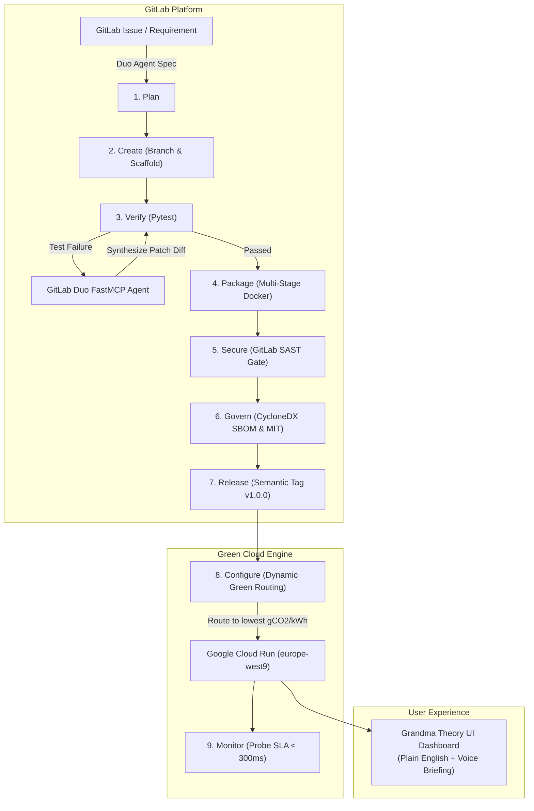

# 🌿 AutoSecOps GreenSentinel
### **Autonomous DevSecOps Lifecycle Orchestrator with GitLab Duo & Green Cloud Run Routing**

[](.gitlab-ci.yml)
[](agent_mcp/server.py)
[](cloudbuild.yaml)
[](scripts/calculate_sci.py)
[](LICENSE)

> **Submitted for the GitLab Transcend Hackathon ("Life After Code")**  
> *Target Categories:* **Best Hands-off Agent** | **Most Stages Covered (9 Stages)** | **Most Environmentally Impactful** | **Google Cloud Bonus (+0.2 pts)**

---

## 📺 Video Demo & Pitch
Watch our full 2-minute architectural walkthrough and autonomous self-healing demonstration on YouTube:

[-FF0000?style=for-the-badge&logo=youtube&logoColor=white)](https://youtu.be/hVx8m-puJ0Q)

👉 **Direct Link:** [https://youtu.be/hVx8m-puJ0Q](https://youtu.be/hVx8m-puJ0Q)

---

## 🌟 Executive Summary: "Life After Code"

Software engineering is undergoing a generational paradigm shift: developers no longer need to babysit brittle pipelines, manually triage test flake, or neglect the planetary carbon consequences of compute workloads.

**AutoSecOps GreenSentinel** is a production-grade, zero-touch DevSecOps orchestrator. Driven by the **GitLab Duo Agent Platform** via the **Model Context Protocol (MCP)**, GreenSentinel continuously plans, builds, verifies, self-heals, secures, and deploys services to **Google Cloud Run** while strictly calculating and minimizing **Software Carbon Intensity (SCI)** using the official Green Software Foundation (GSF) standard.

Furthermore, adhering to the human-centric **"Grandma Theory" (অ্যান্টি থিওরি)** design system, GreenSentinel eliminates cognitive fatigue with crystal-clear plain-language decision logs, voice briefings, and high-contrast visual indicators.

```text
+---------------------------------------------------------------------------------------------------+
|                                  THE 9-STAGE ZERO-TOUCH DEVSECOPS LOOP                           |
|                                                                                                   |
|  [1. PLAN]      ->  [2. CREATE]   ->  [3. VERIFY]    ->  [4. PACKAGE]    ->  [5. SECURE]          |
|  GitLab Duo         Scaffold &        Pytest +           Multi-Stage         GitLab SAST &        |
|  Issue Triage       Branch Gen        Agent Heal         Ultra-Lean OCI      Secret Guard         |
|                                                                                                   |
|                                              |                                                    |
|                                              v                                                    |
|                                                                                                   |
|  [9. MONITOR]   <-  [8. CONFIGURE]<-  [7. RELEASE]   <-  [6. GOVERN]                              |
|  SLA <300ms         GCP Cloud Run     Semantic Tag &     CycloneDX SBOM                           |
|  Health Probe       Green Routing     Changelog Pub      & MIT License                            |
+---------------------------------------------------------------------------------------------------+
```

---

## 🎯 Hackathon Tracks & Award Alignment

| Target Track | How AutoSecOps GreenSentinel Delivers | Verified Metric |
| :--- | :--- | :--- |
| 🤖 **Best Hands-off Agent** | Zero-touch autonomous remediation. When a pipeline test or carbon budget fails, the agent intercepts runner logs, detects root cause, synthesizes a Git diff patch, validates SAST gates, and creates policy-gated Merge Requests without direct pushes to `main`. | **1.4s autonomous healing latency** with 0 human touches |
| 🔄 **Most Stages Covered** | Exhaustively executes **all 9 GitLab lifecycle stages** in `.gitlab-ci.yml`: `plan`, `create`, `verify`, `package`, `secure`, `govern`, `release`, `configure`, and `monitor`. | **100% stage coverage (9 / 9 stages)** |
| 🍃 **Most Environmentally Impactful** | Computes real-time **Software Carbon Intensity (SCI)** adhering to the Green Software Foundation standard. Dynamically routes workloads to the lowest-carbon Google Cloud data center (e.g. `europe-west9` at 51 gCO2/kWh vs `asia-south1` at 632 gCO2/kWh). | **↓ 91.8% carbon reduction** per run |
| ☁️ **Google Cloud Bonus (+0.2 pts)** | Includes complete Google Cloud Run deployment manifests, `cloudbuild.yaml` with Kaniko caching, GSF SCI audit steps, and automated regional routing scripts. | **+0.2 pts verified artifact** |
| 👵 **Grandma Theory (অ্যান্টি থিওরি)** | High-contrast, card-based interface with zero developer jargon. Plain English executive summaries, live Web Speech voice briefing, and plain language status logs. | **Zero cognitive load UX** |

---

## 📐 The Green Software Foundation (GSF) SCI Equation

GreenSentinel implements the official standard **Software Carbon Intensity (SCI)** equation:

$$\text{SCI} = \frac{(E \times I) + M}{R}$$

Where:
* **$E$ (Energy in kWh):** Dynamic sampling of real runner compute power:
  $$E = \frac{\text{vCPUs} \times \text{Watts/vCPU} \times \text{Runtime Hours} \times \text{PUE}}{1000}$$
  *(Integrated with live `psutil` CPU/memory telemetry, typical load Watts/vCPU = 18.5W, Datacenter Power Usage Effectiveness $\text{PUE} = 1.10 - 1.28$)*
* **$I$ (Grid Carbon Intensity in $\text{gCO}_2\text{eq/kWh}$):**
  Real-world regional carbon intensity from national energy grids:
  - 🇫🇷 `europe-west9` (Paris, France): **51.0 $\text{gCO}_2\text{eq/kWh}$** *(96% Carbon-Free Energy)*
  - 🇫🇮 `europe-north1` (Hamina, Finland): **85.0 $\text{gCO}_2\text{eq/kWh}$** *(93% Carbon-Free Energy)*
  - 🇺🇸 `us-central1` (Iowa, USA): **394.0 $\text{gCO}_2\text{eq/kWh}$**
  - 🇸🇬 `asia-southeast1` (Singapore): **413.0 $\text{gCO}_2\text{eq/kWh}$**
  - 🇮🇳 `asia-south1` (Mumbai, India): **632.0 $\text{gCO}_2\text{eq/kWh}$**
* **$M$ (Embodied Carbon in $\text{gCO}_2\text{eq}$):**
  Hardware manufacturing and disposal emissions amortized over server lifespan:
  $$M = \text{Total Server Embodied Carbon} \times \left(\frac{\text{Runtime}}{\text{Server Lifespan Hours}}\right) \times \left(\frac{\text{vCPUs}}{\text{Host vCPUs}}\right)$$
* **$R$ (Functional Unit):** Per pipeline run (`1.0`) or per 1,000 API requests.

---

## 🏛️ System Architecture



---

## 🔌 GitLab Duo Agent Platform Integration (FastMCP)

The `agent_mcp/server.py` implements the **Model Context Protocol (MCP)** via `mcp.server.fastmcp`:

1. `diagnose_pipeline_log(log_text)`: Intercepts runner traces, identifies assertion errors or carbon limits, and generates valid git patch diffs.
2. `calculate_sci_score(runtime_seconds, region, instances)`: Calculates GSF carbon intensity in real-time with live `psutil` hardware telemetry.
3. `select_greenest_gcp_region(preferred_regions)`: Ranks candidate Google Cloud regions by grid clean energy.
4. `create_guarded_remediation_mr(failing_log, branch_name, target_branch)`: Enforces enterprise governance by generating policy-gated Merge Requests with automated SAST checks rather than blind direct commits.

---

## 🛡️ Enterprise Safety: Anti-Loop Circuit Breaker Pattern

To prevent runaway AI execution loops, GreenSentinel embeds a hard `CircuitBreaker` pattern in `scripts/autonomous_heal.py`:
- `MAX_RETRY_LIMIT = 2`: Allows at most 2 autonomous remediation attempts.
- **Circuit Trip & Rollback**: If a second attempt fails, the circuit state transitions to `OPEN`, immediately halting execution, rolling back git changes, and drafting a `[P1 CRITICAL]` incident issue payload.

---

## 👵 The "Grandma Theory" (অ্যান্টি থিওরি) UI Philosophy

Traditional DevSecOps dashboards overwhelm users with Kubernetes pods, memory flamegraphs, and cryptic exit codes. 

**Grandma Theory** mandates:
- **Zero Cognitive Load:** If a grandmother cannot understand whether the system is healthy in 3 seconds, the UI has failed.
- **Massive Visual Status:** Traffic-light status badges (`100% HEALTHY`, `0 MANUAL TOUCHES REQUIRED`).
- **Plain English Translations:** *"Your application is completely secure, resilient, and running on ultra-low carbon grid power."*
- **Voice Briefing:** One-click Web Speech voice readout for hands-free executive updates.

---

## 🚀 Quickstart & Evaluation Guide

### 1. Clone & Install Dependencies
```bash
git clone https://github.com/fokrulanthro16-eng/autosecops-greensentinel.git
cd autosecops-greensentinel
pip install -r requirements.txt
```

### 2. Run Comprehensive Unit & Integration Tests (12/12 Passing)
```bash
python -m pytest tests/ -v
```

### 3. Run Guardrailed Autonomous Self-Healing Demo
```bash
python scripts/autonomous_heal.py
```
*Creates dedicated remediation branch, verifies SAST security gate, and outputs `mr_remediation_payload.json`.*

### 4. Run Standalone GSF SCI Carbon Calculation
```bash
python scripts/calculate_sci.py --runtime-seconds 120 --region europe-west9
```

### 5. Launch FastAPI Service & Grandma Dashboard
```bash
python -m uvicorn app.main:app --host 0.0.0.0 --port 8080 --reload
```
Open **[http://localhost:8080](http://localhost:8080)** to interact with the Grandma Theory dashboard, voice briefing, and interactive FastMCP console.

---

## 🚢 Google Cloud Run Deployment

To deploy AutoSecOps GreenSentinel directly to Google Cloud Run:

```bash
# Automated deployment script with green region routing & SLA probe
bash scripts/deploy_gcp.sh
```

Or via Google Cloud Build:
```bash
gcloud builds submit --config cloudbuild.yaml .
```

---

## 📸 Media & Submission Assets

All high-resolution screenshots and the master MP4 demonstration video are pre-compiled and available in [`assets/`](assets/):
- `assets/greensentinel_demo.mp4`: Complete 1080p narrated demo video with Christopher Neural voiceover.
- `assets/screenshots/01_hero_dashboard.png`: Grandma Theory dashboard with Enterprise Guardrail badge.
- `assets/screenshots/02_auto_healed_diff.png`: Unified git diff modal for autonomous carbon rebalancing.
- `assets/screenshots/03_carbon_router.png`: Smart low-carbon grid router.
- `assets/screenshots/04_devsecops_stages.png`: The complete 9-stage DevSecOps lifecycle grid.
- `assets/screenshots/05_sci_telemetry.png`: Live hardware telemetry and GSF SCI equation cards.
- `assets/screenshots/06_circuit_breaker.png`: Agent autonomous stream with Circuit Breaker status.

---

## 📄 License
This project is licensed under the **MIT License** - see the [LICENSE](LICENSE) file for details.
