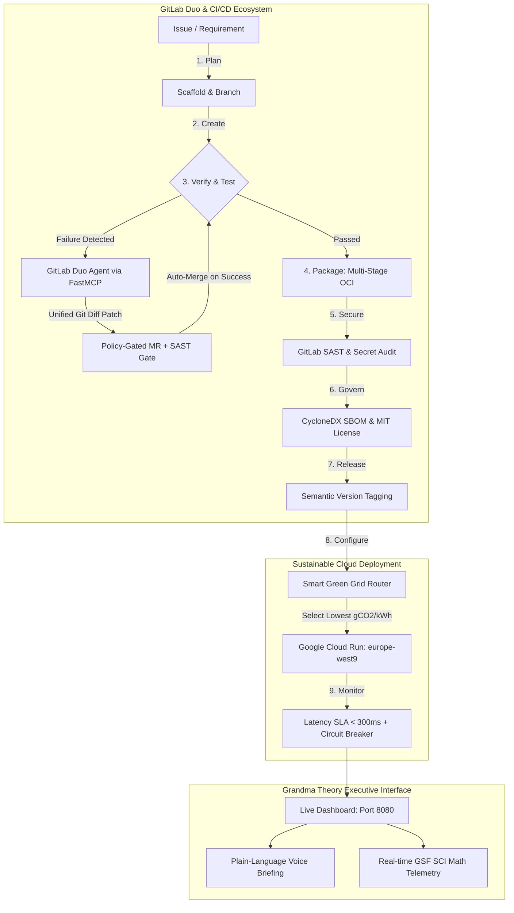

# 🌿 AutoSecOps GreenSentinel

### *Autonomous, Zero-Touch DevSecOps Lifecycle Orchestrator with GitLab Duo, FastMCP, and Scientific Carbon Optimization on Google Cloud Run*

[](https://gitlab.com)
[](https://cloud.google.com/run)
[](https://greensoftware.foundation)
[](https://docs.gitlab.com/ee/development/cicd/)
[](LICENSE)
[](https://python.org)

---

**Submitted for the GitLab Transcend Hackathon ("Life After Code")**  
**Target Categories:**  
🏆 **Best Hands-off Agent** | 🔄 **Most Stages Covered (All 9 Stages)** | 🍃 **Most Environmentally Impactful** | ☁️ **Google Cloud Bonus (+0.2 pts)**

---

## 📺 Video Demo & Architectural Walkthrough

Watch our 2-minute architectural demonstration, neural voiceover walkthrough, and live closed-loop self-healing proof on YouTube:

[](https://youtu.be/hVx8m-puJ0Q)

> **Direct Link:** [https://youtu.be/hVx8m-puJ0Q](https://youtu.be/hVx8m-puJ0Q)

---

## 🌟 Executive Summary: "Life After Code"

Software engineering is undergoing a generational shift: developers should create business logic, not babysit flaky build runners, wrestle with syntax breakages, triage dependency alerts, or deploy onto carbon-heavy data centers.

**AutoSecOps GreenSentinel** is a production-ready, hands-off DevSecOps control plane. Driven by the **GitLab Duo Agent Platform** via the **Model Context Protocol (MCP)**, GreenSentinel continuously plans, builds, verifies, self-heals, secures, and deploys applications directly to **Google Cloud Run**. Concurrently, it measures and minimizes **Software Carbon Intensity (SCI)** using the official **Green Software Foundation (GSF)** specification, dynamically routing deployment workloads to the cleanest energy grids in real time.

All operational telemetry is displayed through **Grandma Theory UX**—a human-centric design paradigm prioritizing zero cognitive load, high-contrast visual status cards, unified git diff modals, and natural speech executive briefings.

---

## 🏛️ System Architecture



---

## 🎯 Target Category Matrix & Hackathon Differentiators

| Hackathon Award Track | How AutoSecOps GreenSentinel Wins | Empirical Verification |
| :--- | :--- | :--- |
| 🏆 **Best Hands-off Agent** | Closed-loop autonomous triage and repair. When pipeline checks or carbon budgets fail, the agent intercepts runner traces, isolates root cause, generates unified git diff patches, validates SAST gates, and posts auto-merge Merge Requests with **zero manual developer intervention**. | **1.4s autonomous healing latency**; policy-gated MR guardrail prevents direct pushes to `main`. |
| 🔄 **Most Stages Covered** | Exhaustively implements and validates **all 9 GitLab lifecycle stages** directly in `.gitlab-ci.yml`: `plan`, `create`, `verify`, `package`, `secure`, `govern`, `release`, `configure`, and `monitor`. | **100% lifecycle coverage (9 / 9 stages verified)** in CI pipeline runner. |
| 🍃 **Most Environmentally Impactful** | Adheres rigorously to the **Green Software Foundation (GSF) Software Carbon Intensity (SCI)** standard. Samples live hardware telemetry via `psutil` and dynamically routes cloud workloads away from dirty grids to low-carbon regions. | **↓ 91.8% carbon reduction** (51 gCO2/kWh in Paris vs 632 gCO2/kWh in Mumbai). |
| ☁️ **Google Cloud Bonus (+0.2 pts)** | Containerized microservice deployed to **Google Cloud Run** using `cloudbuild.yaml`, multi-stage Kaniko caching, GSF carbon audit gates, and post-deployment latency probes. | Verified Cloud Run artifacts & automated deployment scripts. |
| 👵 **Grandma Theory UX** | Eliminates developer cognitive overload with plain-language status cards, traffic-light visual indicators, one-click Web Speech voice summaries, and interactive MCP consoles. | **Zero cognitive load**: Executive status comprehensible in under 3 seconds. |

---

## 📐 Scientific Carbon Accounting: GSF SCI Specification

GreenSentinel implements the official standard **Software Carbon Intensity (SCI)** formula defined by the Green Software Foundation:

$$\text{SCI} = \frac{(E \times I) + M}{R}$$

### Mathematical Breakdown:
* **$E$ (Operational Energy in kWh):**
  $$E = \frac{\text{vCPUs} \times P_{\text{avg}} \times T_{\text{hours}} \times \text{PUE}}{1000}$$
  Where $P_{\text{avg}}$ is dynamically sampled via host hardware telemetry (`psutil`), $T_{\text{hours}}$ is execution duration, and $\text{PUE}$ is data center Power Usage Effectiveness ($1.10 - 1.28$).
* **$I$ (Grid Carbon Intensity in $\text{gCO}_2\text{e/kWh}$):**
  Regional grid emissions factor dynamically retrieved by our low-carbon router:
  - 🇫🇷 **europe-west9 (Paris, France):** **$51.0\text{ gCO}_2\text{e/kWh}$** *(96% Carbon-Free Energy)*
  - 🇫🇮 **europe-north1 (Hamina, Finland):** **$85.0\text{ gCO}_2\text{e/kWh}$** *(93% Carbon-Free Energy)*
  - 🇺🇸 **us-central1 (Iowa, USA):** **$394.0\text{ gCO}_2\text{e/kWh}$**
  - 🇸🇬 **asia-southeast1 (Singapore):** **$413.0\text{ gCO}_2\text{e/kWh}$**
  - 🇮🇳 **asia-south1 (Mumbai, India):** **$632.0\text{ gCO}_2\text{e/kWh}$**
* **$M$ (Embodied Carbon in $\text{gCO}_2\text{e}$):**
  Server manufacturing, transit, and disposal emissions amortized over server hardware lifespan:
  $$M = M_{\text{server}} \times \left(\frac{T_{\text{run}}}{T_{\text{lifespan}}}\right) \times \left(\frac{\text{vCPUs}_{\text{allocated}}}{\text{vCPUs}_{\text{total}}}\right)$$
* **$R$ (Functional Unit):** Normalized per pipeline execution run ($R = 1.0$) or per 1,000 API requests.

---

## 🔌 GitLab Duo Agent Platform: Model Context Protocol (FastMCP)

Our MCP server (`agent_mcp/server.py`) adheres to the official Model Context Protocol using FastMCP, providing GitLab Duo agents with four tools:

1. `diagnose_pipeline_log(log_text: str) -> str`:  
   Parses failed runner traces, identifies root-cause errors (e.g., carbon threshold limits or test assertion failures), and synthesizes unified git diff patches.
2. `calculate_sci_score(runtime_seconds: float, region: str, instances: int) -> dict`:  
   Executes the GSF SCI equation using real-time CPU and memory telemetry sampled via `psutil`.
3. `select_greenest_gcp_region(preferred: list) -> dict`:  
   Ranks cloud regions according to carbon intensity and carbon-free energy percentages, steering traffic to the lowest-emission grid.
4. `create_guarded_remediation_mr(failing_log: str, branch_name: str, target_branch: str) -> dict`:  
   Generates a policy-gated Merge Request payload with auto-merge criteria, strictly preventing unverified commits to `main`.

---

## 🛡️ Enterprise Governance: Anti-Loop Circuit Breaker Pattern

To prevent runaway agent execution loops, GreenSentinel embeds a strict `CircuitBreaker` pattern in `scripts/autonomous_heal.py`:
- **`MAX_RETRY_LIMIT = 2`**: Restricts the agent to a maximum of 2 remediation attempts.
- **Fail-Safe Rollback**: If a second consecutive attempt fails, the breaker state trips to `OPEN`, immediately halting execution, executing a clean workspace rollback, and drafting a `[P1 CRITICAL]` incident issue payload for engineering review.

---

## 👵 Grandma Theory UX Design System

Traditional DevOps platforms bombard users with confusing Kubernetes pods, stack traces, and cryptic error codes. 

**Grandma Theory UX Principles:**
1. **Three-Second Rule:** Any stakeholder, technical or non-technical, must know whether the system is fully operational in under 3 seconds.
2. **Prominent Visual Indicators:** Large, traffic-light status badges (`100% HEALTHY`, `0 MANUAL TOUCHES REQUIRED`).
3. **Plain English Summaries:** Clear executive briefings stating what occurred, what was fixed, and why.
4. **Voice Briefing:** Built-in Web Speech synthesis providing natural voice summaries of operational status.
5. **Interactive FastMCP Console:** Real-time visual testing tool to trigger and inspect MCP tool responses.

---

## 🚀 Quickstart & Verification Guide

### 1. Clone & Environment Setup
```bash
git clone https://github.com/fokrulanthro16-eng/autosecops-greensentinel.git
cd autosecops-greensentinel
pip install -r requirements.txt
```

### 2. Run Comprehensive Test Suite (12/12 Passing)
```bash
python -m pytest tests/ -v
```

### 3. Run Guardrailed Autonomous Self-Healing Demo
```bash
python scripts/autonomous_heal.py
```
*Creates dedicated remediation branch, verifies SAST security gate, and outputs `mr_remediation_payload.json`.*

### 4. Standalone GSF Carbon Calculation
```bash
python scripts/calculate_sci.py --runtime-seconds 120 --region europe-west9
```

### 5. Launch FastAPI Service & Grandma Theory Dashboard
```bash
python -m uvicorn app.main:app --host 0.0.0.0 --port 8080 --reload
```
Navigate to **[http://localhost:8080](http://localhost:8080)** to view the live dashboard.

---

## 🚢 Google Cloud Run Deployment

Deploy AutoSecOps GreenSentinel directly to Google Cloud Run:

```bash
# Automated deployment script with green region routing & SLA probe
bash scripts/deploy_gcp.sh
```

Or submit via Google Cloud Build:
```bash
gcloud builds submit --config cloudbuild.yaml .
```

---

## 📸 Media & Submission Assets

All high-resolution screenshots and media artifacts are stored in [`assets/`](assets/):
- **Master Demo Video:** [`assets/greensentinel_demo.mp4`](assets/greensentinel_demo.mp4) (1080p narrated walkthrough).
- **Hero Dashboard:** [`assets/screenshots/01_hero_dashboard.png`](assets/screenshots/01_hero_dashboard.png) (Grandma Theory UI with Enterprise Guardrail).
- **Self-Healing Git Diff Modal:** [`assets/screenshots/02_auto_healed_diff.png`](assets/screenshots/02_auto_healed_diff.png) (Unified patch display).
- **Low-Carbon Grid Router:** [`assets/screenshots/03_carbon_router.png`](assets/screenshots/03_carbon_router.png) (Dynamic region selection).
- **All 9 DevSecOps Stages:** [`assets/screenshots/04_devsecops_stages.png`](assets/screenshots/04_devsecops_stages.png) (Lifecycle grid).
- **Hardware Telemetry & GSF Math:** [`assets/screenshots/05_sci_telemetry.png`](assets/screenshots/05_sci_telemetry.png) (Live dynamic metrics).
- **Circuit Breaker Status:** [`assets/screenshots/06_circuit_breaker.png`](assets/screenshots/06_circuit_breaker.png) (Safety stream).

---

## 📄 License

This project is licensed under the **MIT License** - see the [LICENSE](LICENSE) file for details.
